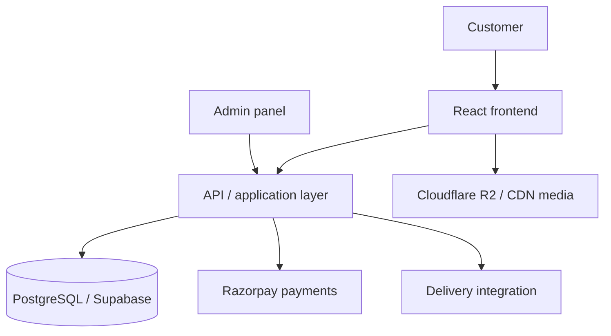
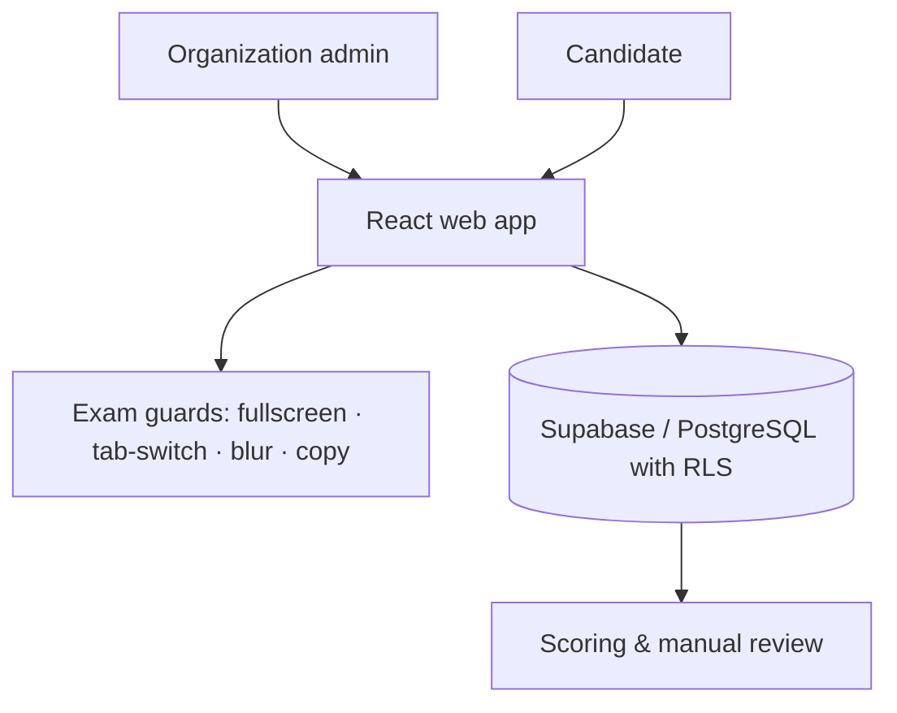
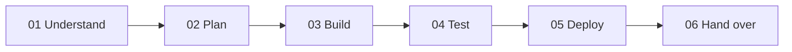

<div align="left">


<h1>Hari Sai Kumar Thatholu</h1>

<h3>Software Engineer · Full-Stack & Backend · AI Systems · Solution Architecture</h3>

<a href="https://github.com/Hari-r31">
  
</a>

<p>
I design and build production-ready web applications, backend systems, SaaS platforms and AI-powered products, from requirements and architecture through development, deployment and ongoing improvements.
</p>

<p>
<b>I work with startups, businesses and engineering teams to turn product requirements into reliable software.</b>
</p>

<p>
  <a href="https://hari-r31.github.io/Portfolio/">
    
  </a>
  <a href="https://www.linkedin.com/in/harisaithatholu">
    
  </a>
  <a href="https://github.com/Hari-r31">
    
  </a>
</p>

<sub>📍 Based in India · Available for remote projects</sub>

<br clear="both">

</div>

<div align="center">

<h3><i>I don't just build features. I take ownership of the system from requirement to production.</i></h3>


<br>


</div>

---

## What I can take ownership of

- **Full-stack web applications & SaaS platforms**, including multi-tenant products
- **Backend APIs & database architecture**
- **AI / LLM integrations** and agent workflows
- **Admin dashboards & internal tools**, ERP systems
- **E-commerce & payment systems**
- **Cloud deployment, CI/CD & production infrastructure**
- **Existing-system debugging, optimization and feature development**
- **Mobile applications**

**Available for:** project-based development · long-term engineering support · technical implementation

## Core expertise

| What I build | Technologies |
| --- | --- |
| **Backend & APIs** | Python · FastAPI · PostgreSQL · Redis |
| **Full-stack applications** | React · Next.js · TypeScript · Tailwind CSS |
| **AI products** | OpenAI API · LangGraph · AI workflows · Structured LLM outputs |
| **SaaS platforms** | Multi-tenant architecture · RBAC · Row-level security |
| **Data systems** | Apache Spark · Airflow · AWS S3 Tables · Apache Iceberg |
| **Cloud & DevOps** | Docker · GitHub Actions · AWS · Azure |
| **Payments & integrations** | Razorpay · REST APIs · Third-party services |

**Also experienced with:** Django · Node.js · Angular · Flutter · MongoDB · Firebase · Kubernetes · Nginx · Cloudflare · and more, see the [full technology profile](#full-technology-profile) below.

<div align="center">

<br>
&nbsp;&nbsp;

</div>

---

## Selected work

Four flagship projects, each shown as **problem → what I built → engineering challenges → result**.

### 1 · Hadha: E-commerce platform · [hadha.co](https://hadha.co/)

**Problem.** A handcrafted 92.5 silver jewellery business needed a modern e-commerce platform with product management, checkout, payments, delivery and administrative controls, one it could run by itself.

**My role.** Full-stack engineer and solution architect.

**What I built**
- Product catalog architecture with **product variants** and **inventory**
- **Inventory reservations**, cart and checkout, order management
- **Razorpay** payment integration with payment verification
- **Delivery integration** and delivery tracking
- Customer accounts and authentication (**Supabase Auth**, **Google OAuth**)
- **Admin panel** for catalog, orders and operations
- **CDN / media architecture** with Cloudflare R2
- Database design, transactional email (Resend) and production deployment

**Architecture**



**Engineering challenges.** Concurrent inventory reservations · payment verification · media delivery · database consistency · authentication · production deployment.

**Problem → Decision → Implementation → Result**

| | |
| --- | --- |
| **Problem** | Multiple customers could try to buy the same limited-stock piece at the same time. |
| **Decision** | Introduce short-lived inventory reservations with expiry and release. |
| **Implementation** | A database-backed reservation flow, with worker-based expiry handling. |
| **Result** | Overselling is prevented while checkout stays responsive. |

**Result.** A production-ready e-commerce platform with the business workflows needed to sell and manage jewellery online.

**Stack.** React · TypeScript · Vite · Supabase · PostgreSQL · Razorpay · Cloudflare (R2, CDN) · Zustand · TanStack Query · Radix UI · Recharts · Docker

---

### 2 · ExamPro: Multi-tenant examination SaaS · [exam-pro.tech](https://www.exam-pro.tech/)

**Problem.** Organizations need to run recruitment tests, employee evaluations and certification exams online without losing exam integrity, and without one organization's data ever touching another's.

**My role.** Full-stack engineer and solution architect.

**What I built**
- **Multi-tenant SaaS** where each organization's exams, candidates and results are completely isolated
- **Layered exam guards:** fullscreen lockdown (exams will not start outside fullscreen); tab-switch, blur and copy-attempt monitoring with activity logs and warnings
- **Timed exams with autosave:** instant saves plus 10-second interval saves
- **Automatic scoring** for multiple choice and **manual review** for written answers

**Architecture**



**Engineering challenges.** SaaS tenant isolation (RLS) · authorization and IDOR/BOLA testing · enforcing exam integrity in the browser.

**Result.** A secure exam platform an organization can use for hiring, evaluation and certification.

**Stack.** React · Vite · TypeScript · Tailwind CSS · Radix UI · Supabase (PostgreSQL, RLS) · Recharts · Vercel

---

### 3 · VPD FrontDesk: Appointment platform · [frontdesk.vpdtechnologies.com](https://frontdesk.vpdtechnologies.com/)

**Problem.** Visitors want to book time with the right person quickly, while reception and staff need control over availability.

**My role.** Full-stack engineer and solution architect.

**What I built**
- Public booking flow that needs **no account**
- **Live availability, re-checked at booking** so slots cannot be double-booked
- 30-minute slots within business hours, with timezone-aware display
- **Staff sign-in** and reception management
- **Email confirmations** for booked appointments

**Engineering challenges.** Slot availability under concurrent bookings · timezone handling · authenticated staff area next to a public booking flow.

**Result.** A working reception and appointment system for the company.

**Stack.** Next.js · React · Tailwind CSS · Radix UI · Vercel

---

### 4 · Production infrastructure & observability

**Problem.** Applications in production need to be deployable, observable and debuggable, not just working on a laptop.

**My role.** Infrastructure and DevOps.

**What I built**
- **VPS deployment** on Ubuntu with **Docker Compose**, **Nginx** reverse proxy and **Cloudflare** in front
- **CI/CD** with GitHub Actions: Docker image builds, **multi-architecture images**, **GHCR**, and SSH / SCP deployment
- **Database migrations during deployment** (Alembic) with production and staging environments
- A complete **monitoring stack:** Prometheus, Grafana, Loki, Promtail, Node Exporter, cAdvisor, Redis Exporter, Uptime Kuma and Dozzle
- **Error tracking** with Sentry and GlitchTip (Sentry JavaScript SDK and Sentry / FastAPI integration)
- Structured logging with request IDs and trace IDs, container health checks and resource limits

**Engineering challenges.** Debugging real monitoring problems, not just installing the tools · repeatable production deployments.

**Result.** A production setup that can be deployed repeatably, watched, and debugged.

**Stack.** Docker · Docker Compose · Nginx · Linux · Cloudflare · GitHub Actions · GHCR · Prometheus · Grafana · Loki · Sentry

---

## Project gallery

### Products & platforms

| Project | What it is | Stack |
| --- | --- | --- |
| **[Tournament365](https://tournament365.in/)** | SaaS-based ERP for tournament management, self-hosted on Ubuntu / Nginx | Angular · Bootstrap · Nginx |
| **[AI Plant Doctor](https://github.com/Hari-r31/smart-plant-doctor)** *(May 2025 · Completed)* | End-to-end smart agriculture: ESP32 with DHT11, soil-moisture and LDR sensors sends data to Supabase via REST; FastAPI runs AI leaf-disease detection; React dashboard shows live stats, image uploads, alerts and disease history | ESP32 · FastAPI · React · Supabase (storage + RLS) · TensorFlow / Keras · Vercel · Render |

```text
ESP32 sensors ──REST──▶ Supabase ◀── FastAPI (AI leaf-disease detection) ──▶ React dashboard
```

### Client & business websites

| Site | About | Stack |
| --- | --- | --- |
| **[VPD Technologies](https://vpdtechnologies.com/)** | Company landing page: premium software engineering & web architecture | React · Vite · Tailwind CSS · Vercel |
| **[M&A Construction Services LLC](https://maconstruction-llc.com/)** 🇺🇸 | Construction estimating, BIM and project controls | React · Vite · Hostinger |
| **[TechGigz Australia](https://www.techgigz.com.au/)** 🇦🇺 | Custom software development & IT solutions, Perth | React · Vite · Vercel |
| **[MMP Consultants](https://www.mmpconsultants.com.au/)** 🇦🇺 | Consulting & project support services | React · Vite · Vercel |
| **[N Farms Staycation](https://nfarms.netlify.app/)** 🇮🇳 | Luxury farmstay resort in Moinabad, Telangana | Next.js · Tailwind CSS · Razorpay · Netlify |
| **[Prolift Badminton Academy](https://proliftacademy.netlify.app/)** 🇮🇳 | Training academy in Bangalore | Next.js · Tailwind CSS · Cloudinary · Netlify |
| **[Sri Jyothi Travels](https://sri-jyothi-travels.vercel.app/)** 🇮🇳 | Taxi service in Palakollu, Andhra Pradesh: airport and railway-station transfers, local rides and outstation trips, in Telugu, Hindi and English | React · Vite · TanStack · Lucide · Vercel |

### Archive: student projects & mentorship

B.Tech projects built for students as a freelancer, plus mentoring.

| Project | Details | Stack | Links |
| --- | --- | --- | --- |
| **IoT Fish Pond Monitoring & Production Enhancement** *(Jan – May 2024)* | Real-time water-quality monitoring (temperature, pH, dissolved oxygen, turbidity, ammonia) with Blynk, ThingSpeak and Twilio SMS alerts, plus remote control of aerators, feeders and pumps | C++ · Arduino IDE · Blynk · ThingSpeak · Twilio | [Repo](https://github.com/Hari-r31/IOT-Based-Fish-Pond-Monitoring-its-Production-Enhancement-System) |
| **NodeMCU WiFi-Controlled Car** *(Feb – Mar 2023)* | NodeMCU (ESP8266) and L298N motor driver, controlled through the Blynk app | C++ · Arduino IDE · Blynk | [Repo](https://github.com/Hari-r31/Node-MCU-Based-Mobile-Controlled-Car-Through-WIFI) |
| **BMS Dashboard & Firmware** | Web monitoring dashboard paired with embedded device firmware | TypeScript · C++ · C | [Dashboard](https://github.com/Hari-r31/bms-dashboard) · [Firmware](https://github.com/Hari-r31/BMS_Firmware) |
| **AI Smart Traffic System** | Simulated AI traffic-signal control: virtual IoT sensors over MQTT, reinforcement learning (Q-learning), multi-intersection coordination, weather / pedestrian / emergency handling and a Node-RED dashboard | Python · MQTT · Reinforcement Learning · Node-RED | [Repo](https://github.com/Hari-r31/ai_smart_traffic_system) |
| **Conversational AI FAQ Bot** | Command-line bot that answers questions from a predefined FAQ set using a LangGraph flow | Python · LangGraph | [Repo](https://github.com/Hari-r31/Conversational-AI-Simple-FAQ-Bot-LangGraph-) |
| **VIET Campus Kiosk** (Navigation Bot) | Multilingual (English / Telugu / Hindi) touch-screen kiosk for VIET: campus navigation, fee information, a voice-enabled Gemini AI assistant and QR handoff of directions to a phone | React · TypeScript · Vite · Tailwind CSS · Google Gemini · Python · Docker | [Frontend](https://github.com/Hari-r31/VIET_Navigation_Bot) · [Backend](https://github.com/Hari-r31/VIET_Navigation_Bot_backend) · [Live](https://viet-navigation-bot.vercel.app) |

---

## How I work



| Step | What happens |
| --- | --- |
| **01 · Understand** | I start with the business requirement, users, workflows and constraints. |
| **02 · Plan** | I break the requirement into architecture, database design, APIs, frontend workflows and deployment requirements. |
| **03 · Build** | I develop incrementally with clear milestones and maintainable code. |
| **04 · Test** | I validate APIs, workflows, authentication, edge cases and critical business logic. |
| **05 · Deploy** | I handle production deployment, environment configuration, CI/CD and monitoring. |
| **06 · Hand over** | I provide documentation and make the system understandable for the client's team. |

### You can give me

Figma designs · PRDs and requirements · existing repositories · bug lists · API specifications · database requirements · existing applications that need improvements · MVP ideas · SaaS concepts · AI integration requirements

### I can take it from there

**Requirement → Architecture → Development → Testing → Deployment**

## Client & delivery experience

- End-to-end project ownership
- Requirements → production delivery
- Experience working with distributed teams
- Production deployments
- Existing-system maintenance
- API integrations
- Documentation
- Testing & QA
- Post-launch support

**Selected client work**

| Region | Clients |
| --- | --- |
| 🇺🇸 **USA** | M&A Construction Services LLC |
| 🇦🇺 **Australia** | TechGigz Australia · MMP Consultants |
| 🇮🇳 **India** | Hadha · N Farms Staycation · Prolift Badminton Academy · Sri Jyothi Travels · Tournament365 · VPD Technologies |

## Production engineering

I don't stop at writing application code.

| Area | What I work with |
| --- | --- |
| **Infrastructure** | Docker · Docker Compose · Linux (Ubuntu) · Nginx · Cloudflare · VPS deployment · Vercel · Render · Netlify · AWS · Azure |
| **CI/CD** | GitHub Actions · automated builds · deployment pipelines · environment management · production / staging |
| **Reliability** | Health checks · structured logging · monitoring · metrics · error tracking · Redis · database optimization |
| **Security** | Authentication / authorization · RBAC · RLS · API security · secret management · tenant isolation |

## Experience

### [VPD Technologies](https://vpdtechnologies.com) · Kurnool, India · Freelance
*June 2026 – Present* · [LinkedIn](https://www.linkedin.com/company/vpdtechnologies/)

**Solutions Architect & Project Manager** · Full-stack engineering lead

Lead end-to-end delivery of software projects, combining hands-on engineering with architecture, technical planning, team coordination and production deployment, from product requirements (PRD) to live websites and applications.

- **Solution architecture:** design the architecture and technical approach for web apps, ERP systems, production-grade web applications, internal software tools and mobile applications.
- **Delivery:** own each project from PRD through development, testing and deployment to go-live.
- **Team mentoring:** mentor around **40 people** across frontend, backend, database, testing/QA and deployment.

### Conflowence · Remote
*April 2025 – Present*

**Software Engineer** · May 2026 – Present
**Associate Software Engineer** · April 2025 – May 2026

Backend engineer building scalable APIs, microservices and data ingestion systems for application and AI-driven workflows.

- Develop backend services with **Python and FastAPI**: REST APIs, business logic, authentication and third-party integrations, including OpenAI APIs.
- Build **metadata-driven ingestion pipelines** for fixed-width, delimited, XML and Excel data, handling schema drift, missing headers and malformed records, on **AWS S3 Tables and Apache Iceberg**.
- Design and manage schemas in **PostgreSQL (Supabase)**.
- Worked on backend workflows for AI-driven features across **Periscope, AI Recipe App and Mulegine AI**: OpenAI integrations, prompt-based workflows and structured response processing.
- **Cloud & DevOps:** Azure Functions, Supabase, GitHub Actions and Docker, focused on CI/CD, reliability and debuggable deployments.
- Support React.js integration and API debugging; take part in code reviews, sprint planning and production issue resolution.

**Tech stack:** Python · FastAPI · PostgreSQL (Supabase) · Apache Spark · Airflow · AWS S3 Tables · Apache Iceberg · Azure Functions · GitHub Actions · Docker · Kubernetes · OpenBao / HashiCorp Vault · OpenAI API · Pytest

### Earlier experience

Before moving fully into software engineering, I worked part-time in technical and operational roles while completing my education.

- **Electric 2- & 3-Wheeler Technician** · Part-time · 2021 – 2024: end-to-end repair of electric two- and three-wheelers, from diagnosis and fault-finding to fitting parts, covering wiring, batteries, chargers, motors and controllers.
- **Data Entry Operator** · Bank Valuer Office, Palakol · Part-time · 2018 – 2024: valuation records and report data entry for private and government banks, with accuracy checks and record-keeping.

## Engineering background

**I learned engineering from the ground up.**

```text
Diploma (ECE) → B.Tech (ECE) → M.Tech (VLSI & Embedded) → Technician → Software engineering → Solution architecture → Project leadership
```

My background spans embedded systems, software engineering, backend architecture and production infrastructure. That gives me a systems-oriented approach to software: understanding not only the application layer, but also the data, infrastructure and operational side of a product.

---

## Full technology profile

Everything I've worked with, organized by depth: **core stack**, **strong working experience**, **project experience** and **supporting experience**.

### Core stack

| Area | Technologies |
| --- | --- |
| **Backend** | Python · FastAPI · Django · Django REST Framework · Node.js · Express.js · REST APIs · OpenAPI / Swagger · Pydantic · SQLAlchemy / Async SQLAlchemy · Async programming · WebSockets · JWT / OAuth2 · Authentication & authorization · Background workers / jobs |
| **Frontend** | React · Next.js (App Router, server / client components, Next.js APIs) · TypeScript · JavaScript · Vite · Tailwind CSS · React Router · TanStack Query · Zustand · Recharts · Radix UI · shadcn/ui · Axios · Responsive UI development |
| **Databases** | PostgreSQL · Supabase · Redis · MySQL · MongoDB · Firebase / Firestore · Schema design · Migrations / Alembic · Row-level security (RLS) · Indexing & constraints · Query optimization · Transactions & concurrency |
| **Languages** | Python · TypeScript · JavaScript · SQL |

### Strong working experience

| Area | Technologies |
| --- | --- |
| **AI / LLM** | OpenAI API · LLM integrations · Prompt engineering · Structured LLM outputs · AI agents · LangGraph · AI workflows · Function / tool calling · AI-assisted backend workflows · AI image classification · CNN / TensorFlow / Keras · Leaf-disease detection · Google Gemini |
| **AI projects** | AI Recipe / Meal Scan · AI Plant Doctor · Conversational AI FAQ · Periscope · Valhuntir / SIFT / OpenSearch POC · AI-driven backend workflows |
| **Data engineering** | Apache Spark · Apache Airflow · AWS S3 Tables · Apache Iceberg · PostgreSQL · Data ingestion pipelines · ETL / data processing · Metadata-driven ingestion · Fixed-width, delimited, XML and Excel files · Schema-drift handling · Malformed-record handling · Data reprocessing |
| **Cloud** | AWS · AWS S3 · AWS S3 Tables · Azure · Azure Functions · Supabase · Vercel · Render · Netlify · Firebase Hosting · Cloudflare |
| **Infrastructure** | Docker · Docker Compose · Linux · Ubuntu · VPS · Nginx · Reverse proxies · Cloudflare · CDN · Cloudflare R2 · Docker networks · Docker volumes · Container health checks · Resource limits |
| **CI/CD & DevOps** | Git · GitHub · GitHub Actions · CI/CD · GHCR · Docker image builds · Multi-architecture images · Automated deployment · SSH-based deployment · SCP deployment · Vercel and Render deployment · Environment configuration · Production / staging environments · Database migrations during deployment · Alembic · Production troubleshooting |
| **Observability** | Prometheus · Grafana · Loki · Promtail · Node Exporter · cAdvisor · Redis Exporter · Uptime Kuma · Dozzle · Grafana dashboards · Structured logging · Request IDs · Trace IDs · Error tracking |
| **Error tracking** | Sentry · GlitchTip · Sentry JavaScript SDK · Sentry / FastAPI integration |
| **Security** | Secret detection · Regex-based detection · Shannon entropy · Context scoring · Secret validators · Secret remediation workflows · Escalation workflows · Finding lifecycle management · OpenBao · HashiCorp Vault · Authentication · Authorization · RBAC · RLS · IDOR / BOLA testing · SaaS tenant isolation |
| **Security platforms & work** | Periscope · Valhuntir · SIFT · OpenSearch · Akmatori exploration · MCP · Forensic workflows |
| **E-commerce** | Product catalog · Product variants · Inventory · Inventory reservations · Cart · Checkout · Orders · Admin panels · Customer accounts · Delivery workflows |
| **Payments & integrations** | Razorpay · Payment verification · Payment workflows · Resend · Twilio · Delivery APIs · Supabase Auth · Google OAuth · Cloudflare R2 / CDN · OpenAI API |
| **Testing & quality** | Pytest · Backend unit tests · Integration testing · E2E testing · Frontend unit testing · API testing · Postman · TypeScript checking · ESLint · CI test pipelines · Manual QA · Production validation |
| **Architecture & practices** | REST API architecture · Microservices · Monolithic applications · SaaS and multi-tenant architecture · Database architecture · API integration architecture · Authentication & authorization architecture · RBAC · RLS · Caching (Redis) · Concurrency · Inventory reservation systems · Background workers · Queue-based workflows · CDN architecture · Object storage · CI/CD architecture · Monitoring, logging and error-tracking architecture · Production deployment architecture · Security architecture |

### Project experience

| Area | Technologies |
| --- | --- |
| **Other frontend frameworks** | Angular · Bootstrap |
| **Mobile** | React Native · Expo · Flutter · Dart · Firebase Authentication · Firebase Push Notifications |
| **IoT & embedded hardware** | ESP32 · ESP8266 / NodeMCU · Arduino · Sensors (DHT11, soil moisture, LDR, pH, dissolved oxygen, turbidity, ammonia) · Motors · Controllers |
| **IoT & embedded software** | C · C++ · Arduino IDE · Blynk · ThingSpeak · MQTT · Node-RED · Twilio |
| **IoT projects** | Fish pond monitoring · AI Plant Doctor · Smart traffic system · WiFi-controlled vehicle · BMS dashboard / firmware |
| **Other languages** | C · C++ · Dart · HTML · CSS |

### Supporting experience

| Area | Technologies |
| --- | --- |
| **Tools & workflow** | Git · GitHub · GitHub Actions · VS Code · Postman · Docker · Linux · Swagger / OpenAPI · Claude · OpenAI · MCP · Markdown / documentation · PR and code review workflows · Agile / sprint workflows |

---

## Education & credentials

| Institution | Program | Years |
| --- | --- | --- |
| **Visakha Institute of Engineering & Technology**, Narava | Master's degree, VLSI & Embedded Systems | Oct 2024 – May 2026 |
| **QSpiders** (Software Testing Training Institute) | Python Full Stack Development Training | May 2024 – Feb 2025 |
| **Visakha Institute of Engineering & Technology**, Narava | Bachelor of Technology, Electrical, Electronics and Communications Engineering | 2021 – 2024 |
| **Sir C.V. Raman Polytechnic College**, Ullamparru | Diploma, Electronics and Communication Engineering | 2018 – 2021 |

**Publications**
- *Monitoring of Fish Pond Based on IoT & its Enhanced Production System*: IJARESM, Vol. 12, Issue 6, June 8, 2024.
- *Study of stacked high-k Gate-All-Around FET*: IJARCCE, Vol. 12, Issue 7, July 19, 2023. [DOI: 10.17148/IJARCCE.2023.12703](https://doi.org/10.17148/IJARCCE.2023.12703)

**Certifications & courses:** Deloitte Australia Data Analytics Job Simulation · CCNA R&S: Routing and Switching Essentials · CCNAv7: Introduction to Networks

**Languages:** English (Professional working) · Telugu (Native or bilingual) · Hindi (Elementary)

## Let's work together

**Give me a requirement. I can understand it, design it, build it, test it, deploy it, and communicate what I've done.**

Have a project in mind, an existing system that needs work, or an idea that needs an engineer to own it?

Reach me on [LinkedIn](https://www.linkedin.com/in/harisaithatholu) or through my [portfolio](https://hari-r31.github.io/Portfolio/).

<br>

<div align="center">

<picture>
  <source media="(prefers-color-scheme: dark)" srcset="https://raw.githubusercontent.com/Hari-r31/Hari-r31/output/github-contribution-grid-snake-dark.svg">
  <source media="(prefers-color-scheme: light)" srcset="https://raw.githubusercontent.com/Hari-r31/Hari-r31/output/github-contribution-grid-snake.svg">
  
</picture>

<br>

<sub><b>© Hari Sai Kumar Thatholu</b></sub>

</div>
